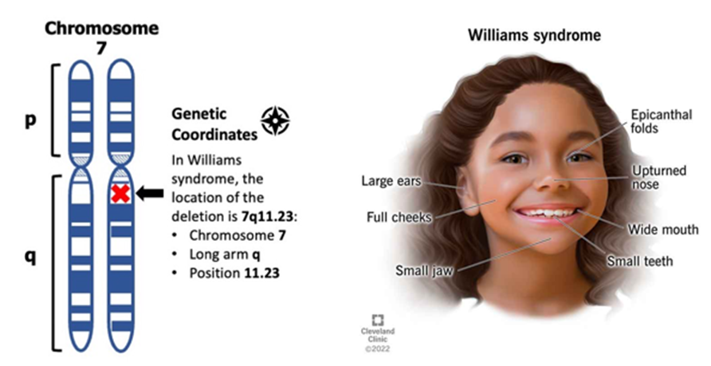

# The Genetics of Neuroplasticity
*By Adrienne Kast*

```{contents}
```

## Introduction
William’s Syndrome (WS), a genetic condition resulting from a partial deletion of chromosome 7 (Atkinson et al., 1997), leads to a distinctive facial structure, cardiovascular disease, cognitive impairments, and unique social behaviors. Despite the cognitive deficits, William’s Syndrome tends to result in high sociability and enhanced empathy (Kleberg et al., 2022). 


Figure 1 The location of chromosome 7 deletion in WS patients (Lurie Children’s Hospital), and the characteristic facial abnormalities that result from this mutation.

This disorder both increases and decreases different aspects of neuroplasticity. Structural brain differences provide the framework for these differences in plasticity. While impairments to the dorsal stream processes are believed to be to the cause of the cognitive impairments, researchers are still divided on the mechanistic changes related to the characteristic social profile of WS (Mills et al., 2014). Amongst the various hypotheses, an enlarged fusiform face area (responsible for facial recognition) and amygdala (the emotion center of the brain) are commonly attributed to the excessive sociability of those with WS (Haas & Reiss, 2012). The genetic basis of William’s Syndrome, as well as other disorders we will discuss later in this chapter, emphasize the genetic predetermination of the brain’s potential for plasticity. Starting with a review of basic genetics, this chapter will go on to address several genetic mechanisms of plasticity and the extent to which neuroplasticity is bound by one’s genome. 

## The Basics of Genetics
Before we delve into the genetics of neuroplasticity, we must first understand the basics of genetics. The human genome contains all the information necessary to create every precise detail of each of our cells, ultimately determining the structure and function of our body as a whole. DNA, a complex arrangement of chemical bases (nucleotides), makes up our entire genetic blueprint. In the human genome, DNA is packaged into a set of 23 chromosomes, each containing two chromatids. Chromatids can contain either the same (homozygous) or different (heterozygous) versions of a specific gene. These different gene variants are called alleles. 


Figure 2 A human male karyotype (the array of chromosomes that make up an individuals’s genome).

Each chromosome contains many genes, specific segments of DNA, that provide the instructions for making proteins. Proteins are the building blocks of all organisms and are responsible for various vital functions throughout the body (NHGRI, 2021). The existence of trait diversity within the human population relies on genetic variation. Variation is maintained through inheritance, the process by which traits are passed down from parent to child (Jorde, 2018). Genetic mutations also increase genetic diversity and can occur spontaneously or as the result of exposure to environmental factors such as radiation. Various kinds of mutations can occur, involving a single nucleotide or several. Mutations can have a wide range of impact on one’s phenotype, from no change at all to a fatal rearrangement or absence of genes. In the end, as the basis of all bodily structures and functions, our genes inherently rule over our potential for plasticity. 

## The Role of Genetics in Neuroplasticity
Genes provide the foundation of all neurological processes. Specific proteins, coded for by these genes, are necessary for the facilitation and inhibition of countless brain mechanisms that are responsible for plasticity potentials. In this section, we will review two specific genes directly related to neuroplasticity: Val66met and APOE4. Val66met is a single nucleotide polymorphism (SNP) of the brain-derived n eurotrophic factor (BDNF) gene. SNPs are different variations of a gene resulting from a single nucleotide substitution mutation (Finan et al., 2019). BDNF, a protein that modulates plasticity of the hippocampus and hippocampal-dependent memory, facilitates long-term potentiation (LTP) through its application (Egan et al., 2003). About 30% of the United States population is a carrier of at least one Val66met allele. Several studies suggest that this mutation leads to impaired episodic memory, motor function, and motor learning compared to those with the typical BDNF gene (Finan et al., 2019). Val66met carriers have lower rates of BDNF expression, thus decreasing LTP. Val66met carriers have also been seen to have reduced grey matter volume in the amygdala and the dorsolateral prefrontal cortex in addition to a lower hippocampal volume (Finan et al., 2019). Furthermore, Val66met has been associated with several neurodegenerative diseases, including Alzheimer’s Disease (Krueger et al., 2011).

The previous information regarding the effects of the Val66met SNP reflects the plasticity of typical individuals with this variation. Despite several cognitive impairments attributed to this SNP, Val66met tends to increase plasticity after a traumatic brain injury (TBI). Compared to the more common BDNF gene, Val66met has shown to increase executive functioning in the brain after a TBI (Krueger et al., 2011). This suggests that individuals with this polymorphism have a greater capacity for regenerative plasticity, despite their learning and memory impairments (McAllister, 2015). The mechanism for this regenerative catalyst property has yet to be determined.

APOE is a protein that helps carry cholesterol and other lipids between different cell types and tissues. Proper lipid levels are essential for many cell processes. APOE also plays a significant role in the growth and regeneration of central nervous system and peripheral nervous system tissues, as well as the modulation of neuronal repair and protection (Pearson-Fuhrhop et al., 2018). Studies suggest that issues with neural ability to process lipids may be highly associated with Alzheimer’s disease and dementia (Bryant, 2021). 


Figure 3 These graphs depict the frequency of allele presence in the general population compared to the population of individuals with Alzheimer’s disease (Foster & Porges, 2022).

The APOE4 allele, which reduces cholesterol efflux, is associated with a significantly increased risk for the development of Alzheimer’s disease and cardiovascular diseases compared to the typical APOE3 allele (Sienski et al., 2021). Furthermore, the APOE4 allele is linked to impaired memory and processing speed. However, APOE2, associated with reduced amyloid buildup, has shown to lessen the risk of developing Alzheimer’s disease (Marioni et al., 2016). Further research is required to understand this protective mechanism. 

```{note}
**Are There Sex-Specific Differences in Plasticity?**

There are numerous clear differences between males and females, both physically and behaviorally. Differences facilitated by either an XX (female) or XY (male) chromosome configuration don’t stop there. Sex hormones, specifically estrogen and testosterone directly impact cognitive functioning. Concentrations of these hormones are regulated by X and Y chromosomes. 


Interestingly, the influence of sex hormones on structural plasticity is more significant in females, likely due to cyclical fluctuations of these hormones (Hyer et al., 2018). In general, females have twice as much dendritic spine density as males. Spine density within females, specifically in the hippocampus, peaks during ovulation, which is when estrogen concentration is highest. Therefore, females experience the highest levels of plasticity during this time. When it comes to aging-related conditions, females are twice as likely to experience cognitive decline and Alzheimer’s disease, often attributed to changes in peri-menopausal hormones concentrations (Harrington et al., 2022). 

Through analysis of structural plasticity in males, hippocampal volume is typically larger, which is attributed to the higher concentrations of testosterone. In addition, the male sex hormone is believed to inhibit LTP and dendritic sprouting in the hippocampus, as well as BDNF-dependent structural plasticity (Hyer et al., 2018).

Differences in neuroplasticity between the sexes can also be observed through the prevalence of mood disorders. For example, females are twice as likely to be diagnosed with major depressive disorder (MDD). In addition, females are also at a higher risk for stress related disorders. These mental disorder related differences between the sexes are also typically attributed to hormone concentrations and other downstream effects of neuronal organization (Rubinow & Schmidt, 2019).

In the end, many factors contribute to the differences in neuroplasticity between males and females. In addition to chromosomal configurations, it is also important to consider the impact of sociology-cultural influence as well as personal experiences on the differences in neuroplasticity across all individuals.


```

There are undoubtedly countless additional gene variations that play a role in each aspect of neuroplasticity, even if their impact is small. The study of genetics, especially neural genetics, is continuously evolving, and additional research will be essential in understanding the mechanisms behind how different genes and their allele frequencies facilitate varying levels of neuroplasticity between individuals. Through reviewing the effects of BDNF and APOE alleles, we can identify a clear pattern of how genetics can directly increase and decrease neuroplasticity. We will continue to explore this idea through addressing the epigenetic implications of plasticity as well as examples of how specific disorders can increase and decrease one’s overall potential for plasticity in the brain.

## Epigenetic Factors of Plasticity
Epigenetics refers to changes that occur within gene expression that are not due to mutations within an individual’s DNA sequence. They can occur in response to environmental and behavioral changes. Epigenetic changes are considered to be long lasting and heritable through cellular generations (Felling & Honghun, 2014). Types of epigenetic changes include DNA methylation, which is the process in which a chemical group is added to DNA. This addition blocks the proteins from translating the gene that the sequence codes for. demethylation, the reverse of this process, occurs when the chemical group is removed, thereby allowing the protein to translate the DNA sequence without interference (CDC, 2015). IGF2 is a gene with an important role in brain development and functioning, regulated by DNA methylation. Prenatal nutrition has been shown to impact the rate of IGF2 methylation, which in turn may regulate growth and development of the brain (Pidsley et al., 2021). This connection suggests a reliance of proper brain development on prenatal DNA methylation on corresponding genes.

Another form of epigenetic change is histone modification. Histones are the proteins that DNA is wrapped around, facilitating chromosomal structure. Histones regulate the accessibility of genes through being tightly or loosely packed together. Chemical groups can be added or removed from these proteins, tightening or loosening their connection to each other, a process called acetylation. Genes are more difficult to express when histones are tightly packed (CDC, 2015). Research has shown that proper levels of histone acetylation of the BDNF gene is associated with LTP and long-term memory through regulating its concentration within the hippocampus. In addition to its effects on BDNF expression, histone modification facilitates synaptic plasticity through regulating the expression of several other genes essential for cognitive and memory functions (Geng et al., 2021).

The final epigenetic mechanism we will cover in this chapter is non-coding RNA, also referred to as micro-RNAs. While coding RNA is the translated version of a DNA sequence which is transcribed to make proteins, non-coding RNA aids in controlling gene expression by attaching to and breaking down coding RNA. Noncoding RNA also has the ability to facilitate histone modification through recruiting proteins (CDC, 2015). Non-coding RNA makes up the vast majority of the human genome and plays an extremely important role in the typical regulation of gene expression, especially when it comes to the brain. Learning, memory, and various other complex brain functions are controlled by rapid activity-dependent changes in gene expression which maintain specific protein concentrations within each region of the brain (Leighton & Bredy, 2018). Therefore, neuroplasticity is highly dependent on the activity of non-coding RNA and its ability to respond to minute changes in chemical and protein concentrations in the brain and inhibit or facilitate gene expression accordingly.


Figure 4 An overviews of all three epigenetic mechanisms that regulate gene expression and are thus vital in maintains synaptic plasticity (Labclinics).

In conclusion, many studies suggest that the expression of synaptic plasticity-associated genes through epigenetic regulation is vital for proper formation and consolidation of learning and memory (Geng et al., 2021). The brain’s ability to adapt to changes in the environment and behaviors is essential for synaptic plasticity and is ultimately ruled by the expression of associated genes. While one’s DNA sequence itself can have a major impact on neuroplasticity, it is the epigenetic mechanisms that control the expression of these genes that regulate the brain’s ability to adapt and change.

## Genetic Disorders Affecting Plasticity
Previously we explored various alleles that are responsible for changes in neuroplasticity. In this section we will review two specific genetic disorders that cause significant changes in neuroplasticity: Rett syndrome and Tay-Sachs disease. These changes are apparent through clear physical and cognitive impairments, rather than solely increased risks for neurodegenerative diseases or small deficits in cognitive functioning. 

Rett syndrome (RTT) is a rare genetic disorder caused by a random mutation of the MECP2 gene on the X chromosome. The MeCP2 protein is an epigenetic modulator of gene expression by acting as both a transcriptional activator and repressor (Feldman et al., 2016). This disorder is most commonly observed in females since it typically has fatal outcomes in males (Mayo Clinic, 2022). Because males only have one X chromosome, the mutations on this portion of DNA are more impactful. Individuals with RTT experience normal development up to their first year and a half, at which point they begin a rapid regression. RTT causes decelerated head growth, abnormal hand movements, irregular breathing, and seizures. These symptoms are the result of impaired regulation of the MECP2 gene, which is necessary for normal central nervous system function (Della Sala & Pizzorusso, 2013). MeCP2 expression impacts prenatal neuron formation, postnatal development of synaptic connections, experience dependent synaptic plasticity, as well as maintenance of adult neural function. This maintenance includes synaptic excitation and inhibition, which are critical in the proper functioning of brain circuits and downstream gene regulation (Feldman et al., 2016). 

Tay-Sachs disease is an even more devastating genetic disorder. It is an autosomal recessive, fatal disease caused by frameshift mutations in both alleles of the HEXA gene on chromosome 15 (NHGRH, 2011). This mutation causes a deficiency of the enzyme Beta hexosaminidase A, which is responsible for the degradation of a glycolipid (GM2 ganglioside). This is the major glycolipid of the neuronal cell membrane, which ensures normal cellular activity. Although the prescience of this lipid in this brain is vital for proper functioning, the HEXA gene mutation results in an accumulation of toxic levels of glycolipids. Developmental regression and delays become apparent in children with Tay-Sachs as early as 3 months old, which worsen until a vegetative state is reached around 10 years old, typically followed by death only a couple years later (Ramani & Sankaran, 2023).

These genetic disorders, as well as the mutations described in previous sections, demonstrate the vast scale of impact that genetic variation can have on neuroplasticity. We have seen how even minute changes in a genes coding for proteins involved in neurological functioning can have significant impacts on one’s potential for plasticity. On the other hand, we have also seen how other mutations can limit cognitive functioning to the point of a vegetative state and even death. In the end, it is clear that overall brain functioning is a very fragile mechanism that can be easily limited by the disruption of protein concentrations through genetic mutations and allele variations.

## Chapter Quiz
1. Val66Met is an allele variation of a gene that codes for which of the following proteins?
    * **A.** BDNF
    * **B.** MeCP2
    * **C.** HEXA
    * **D.** APOE
2. Which of the following is a way in which sex hormone concentrations can affect neuroplasticity?
    * **A.** Affect stress response.
    * **B.** Reorganize brain structures.
    * **C.** Limit memory potential.
    * **D.** Inhibit changes in spine density.
3. Which of the following genetic disorders results in a fatal accumulation of glycolipids in the brain?
    * **A.** William’s syndrome
    * **B.** Fragile X syndrome
    * **C.** Tay-Sachs disease
    * **D.** Rett syndrome
4. Why is Rett syndrome more detrimental in males?
    * **A.** Because it occurs on the X chromosome.
    * **B.** Because it occurs on the Y chromosome.
    * **C.** Estrogen is protective against its symptoms.
    * **D.** Rett syndrome only occurs in males.
5. Which of the following epigenetic mechanisms results in the addition of chemical groups directly to a DNA sequence?
    * **A.** Histone modification
    * **B.** DNA methylation
    * **C.** Non-coding RNAs
6. Which of the following is a mechanism by which a genetic mutation can directly affect neuroplasticity?
    * **A.** Inhibiting protein production
    * **B.** Facilitating protein production
    * **C.** Inhibiting epigenetic mechanisms
    * **D.** All of the above
7. Which of the following proteins is most associated with LTP?
    * **A.** APOE
    * **B.** BDNF
    * **C.** MeCP2
    * **D.** HEXA
8. At what time do females experience the highest levels of plasticity?
    * **A.** Menopause
    * **B.** Ovulation
    * **C.** Pregnancy
    * **D.** Menstruation
9. Which APOE allele is believed to be protective against Alzheimer’s disease?
    * **A.** APOE2
    * **B.** APOE3
    * **C.** APOE4
    * **D.** APOE5

## References
```{toggle}
Atkinson, J., Anker, S., Braddick, O., Nokes, L., Mason, A. and Braddick, F. (2001), Visual and visuospatial development in young children with Williams syndrome. Developmental Medicine & Child Neurology, 43:330337. https://doi.org/10.1111/j.1469-8749.2001.tb00213.x

Centered for Disease Control and Prevention (2022). What is Epigenetics? Genomics & Precision Health.

Della Sala, G. and Pizzorusso, T. (2014), Synaptic plasticity and signaling in rett syndrome. Devel Neurobio, 74: 178-196. https://doi.org/10.1002/dneu.22114

Feldman, Danielle, Abhishek Banerjee, Mriganka Sur, "Developmental Dynamics of Rett Syndrome", Neural Plasticity, vol. 2016, Article ID 6154080, 9 pages, 2016. https://doi.org/10.1155/2016/6154080

Haas BW and Reiss AL (2012) Social brain development in Williams syndrome: the current status and directions for future research. Front. Psychology 3:186. doi: 10.3389/fpsyg.2012.00186

Harrington YA, Parisi JM, Duan D, Rojo-Wissar DM, Holingue C, Spira AP. Sex Hormones, Sleep, and Memory: Interrelationships Across the Adult Female Lifespan. Front Aging Neurosci. 2022 Jul 14;14:800278. doi:                                  10.3389/fnagi.2022.800278. 	

Huixia Geng, Hongyang Chen, Haiying Wang, Lai Wang, "The Histone Modifications of Neuronal Plasticity", Neural Plasticity, vol. 2021, Article ID 6690523, 7 pages, 2021. https://doi.org/10.1155/2021/6690523

Hyer MM, Phillips LL, Neigh GN. Sex Differences in Synaptic Plasticity: Hormones and Beyond. Front Mol Neurosci. 2018 Jul 31;11:266. doi: 10.3389/fnmol.2018.00266. 

Jorde, Lynn B. “Genetic Variation and Human Evolution.” ASGH, www.ashg.org/wp-content/uploads/2019/09/genetic-variation-essay.pdf. 

Kleberg, J.L., Riby, D., Fawcett, C. et al. Williams syndrome: reduced orienting to other’s eyes in a hypersocial phenotype. J Autism Dev Disord53, 2786–2797 (2023).

Leighton, L., & Bredy, T. (2018). Functional Interplay between Small Non-Coding RNAs and RNA Modification in the Brain. Non-Coding RNA, 4(2), 15. MDPI AG. Retrieved from http://dx.doi.org/10.3390/ncrna4020015

Marioni, R., Campbell, A., Scotland, G. et al. Differential effects of the APOEe4 allele on different domains of cognitive ability across the life-course. Eur J Hum Genet 24, 919–923 (2016). 

McAllister, Thomas W. (2015) Genetic factors in traumatic brain injury, Handbook of Clinical Neurology, Elsevier, 128. https://doi.org/10.1016/B978-0-444-63521-1.00045-5.

Mills DL, Dai L, Fishman I, Yam A, Appelbaum LG, St George M, Galaburda A, Bellugi U, Korenberg JR. Genetic mapping of brain plasticity across development in Williams syndrome: ERP markers of face and language processing. Dev Neuropsychol. 2013;38(8):613-42. doi: 10.1080/87565641.2013.825617. 

Pearson-Fuhrhop KM, Kleim JA, Cramer SC. Brain plasticity and genetic factors. Top Stroke Rehabil. 2009 Jul-Aug;16(4):282-99. doi: 10.1310/tsr1604-282. PMID: 19740733; PMCID: PMC5800512.

Pidsley R, Dempster E, Troakes C, Al-Sarraj S, Mill J. Epigenetic and genetic variation at the IGF2/H19 imprinting control region on 11p15.5 is associated with cerebellum weight. Epigenetics. 2012 Feb;7(2):155-63. doi: 10.4161/epi.7.2.18910

Ramani PK, Parayil Sankaran B. Tay-Sachs Disease. [Updated 2023 Jan 25]. In: StatPearls [Internet]. Treasure Island (FL): StatPearls Publishing; 2023 Jan-. Available from: https://www.ncbi.nlm.nih.gov/books/NBK564432/

Rubinow, D.R., Schmidt, P.J. Sex differences and the neurobiology of affective disorders. Neuropsychopharmacol 44, 111–128 (2019). https://doi.org/10.1038/s41386-018-0148-z

```