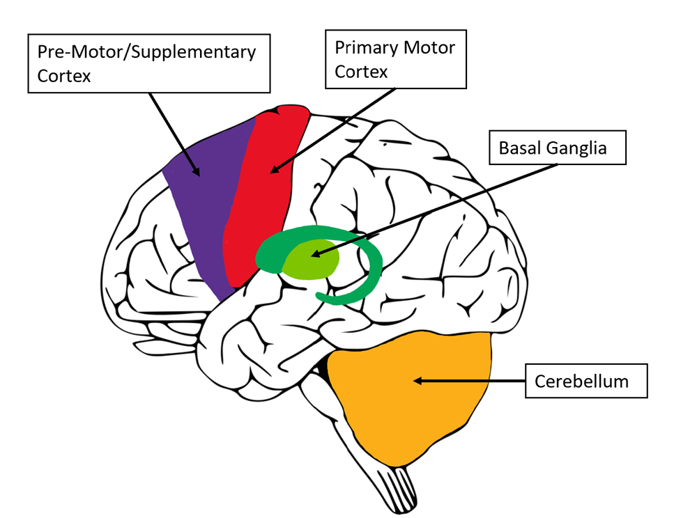

# Movement Training Effects on Plasticity in the Motor System 
*By Lauren Volk*

```{contents}
```

## Introduction
Look at some of the most common health concerns. Cardiac disease. Obesity. Depression and anxiety. Neurodegenerative diseases. Movement and physical activity offer symptom relief for all these conditions. When exercise is incorporated into everyday life, the positive effects are substantial and impact more than just one domain of a person’s health at a time. The activation and integration of a wide variety of brain regions, from exercise lead to substantial and diverse benefits. In this chapter, we will be discussing a specific type of physical activity called movement training and look at its potential to alter brain plasticity and the results in motor response that may then occur. 

## Section 1. What and Where is Movement Training
### 1.1 Defining Movement Training
Some of the typical exercise regimens are either strength training, endurance training, aerobic, or anaerobic-based. More complex regiments will commonly combine several exercise types together to provide a “whole body workout” and allow for multiple motor areas to be activated. Mainstream American workout culture has taken heavily to adapting workout regimens to address one muscle group at a time by having an “arms day” or “legs day” in which all exercises performed within that workout are directed towards a specific muscle group. While this method can be successful in increasing muscle strength within a singular area, there is little focus on holistic muscle activation which can provide similar physical improvements as well as cognitive improvements. The goal of movement training is to engage multiple larger muscle groups at once to create fluid and controlled action responses that can be executed swiftly based on different stimuli. Where strength training focuses on building muscle mass, movement training focuses on increasing the activation of the muscle. In focusing on muscle activation speed and precision are accomplished for movements that may have similar cognitive motor patterns (Perrey, 2013). The muscles are not only adapting and executing based on stimulus but the neural connections are becoming progressively engaged in all current and future movements. 

### 1.2 Areas of the Brain Involved 
The effortless task of picking up a pencil with one’s hand elicits a complex response throughout different areas of the brain. If this is considered a simple task imagine the brain activation and complexity resulting from an exercise that engages multiple muscle groups such as the back, abs, chest, arms, and hands all in one motion. To understand just how movement training can affect brain plasticity we must first examine the areas of the brain affected by basic movement. The pre-motor cortex is the first region to receive and interpret stimulus before a movement response is produced. The planning and organization of what is necessary to produce the appropriate response is observed in this area of the brain. Also located in the frontal lobe is the supplementary motor area which internalizes the desired movement. It is crucial during any type of successful exercise for the participant to visualize themselves accurately performing the movement. The supplementary area creates an internal guide for how to produce the movement envisioned (Sira, 2014). The primary motor cortex is responsible for carrying out the planning that occurs in the pre-motor cortex. When a stimulus is relayed to this region, movement initiation is signaled to different muscle groups. The pyramidal tract neurons, mostly found in the primary motor cortex, connect with neurons in the brainstem and at the beginning of the spinal cord to initiate and control movement (Pressman, 2015). Now that the movement signal has been initiated the cerebellum is responsible for the coordination of multiple muscle groups activating in unison to create an efficient and accurate motor response. The cerebellum is also highly responsible for learning, through taking repeated muscle movements and fine-tuning the activation required to execute them. Another crucial area for motor function includes the basal ganglia which can be considered the gas and break of movement. Activity in the basal ganglia is heavily controlled by a reward circuit in which it will either facilitate a movement with a previously determined positive outcome, through the direct pathway, or inhibit a movement that is negative or possibly harmful, through the indirect pathway. 

When individuals engage in movement training they are not only increasing their physical load but their mental load as well. Each movement is a stimulus to the brain that associated regions must perceive and respond efficiently to. Over time as there is increased stimulus the motor cortex regions will adapt to perform more efficiently and decrease the amount of resources needed to perform an exercise. 


*Figure 1: Motor Control Areas of the Brain*
 
## Section 2. How it Affects the Brain and Movement
### 2.1 Brain’s Activity and Connectivity 
Everyone knows oxygen is essential for life but just how essential is it? As the availability of oxygen in the brain increases, neurotrophins are released, mediating neuronal metabolism. The increased production of neurotrophins supports the activation of additional neurons and improves overall cognitive function. Therefore, increasing cerebral oxygenation is a simple method to improve cognitive function which can be induced by exercise (Perrey, 2013). Exercise is a “stressor” and when the brain undergoes stress it will release molecules to prevent the brain from being overworked. In response, an upregulation of brain-derived neurotrophic factor (BDNF) occurs which is a key protein in regulating the maintenance, growth, and survival of neurons. This increased production of BDNF helps increase neural plasticity by maintaining neuron activity and increasing synaptic signaling between neurons even under increased stress (Perrey, 2013) Movement training can induce an increase in BDNF which in turn can lead to increased synaptic signaling and overall brain region communication, allowing cognition to remain effective even during periods of increased cognitive strain. 

Adaptions in the motor cortex begin to set in as neural pathways increase efficiency in movement execution. Neural pathways become pruned to optimize quick and timely transportation of stimuli and maximize the production of real muscle movement. Not only are the neuro-muscular connections being optimized but the broad motor control systems are improving, maximizing both the efficiency and accuracy of the performed movement. 
	
### 2.2 Feedforward and Feedback Control
Performance level during movement training is heavily regulated by cognitive capabilities and responses to movement stressors both before and after they occur. As training progresses and certain movements become repeated to an extent where they in a sense feel automatic, the feedforward controls provide accuracy for movement execution. When new movements and muscle groups become the key focus during training the feedback controls are initiated to detect possible errors and correct them. For optimal movement and response to occur both feedforward and feedback processes are required (Seidler, 2004). When individuals whether previously trained or new to exercise begin repeatedly activating muscle systems they reinforce feedback processes to process, evaluate, and copy accurate movements that will lead to quicker muscle responses (Krigolsen, 2015).  


*Figure 2: Motor Control Systems*

When a person begins running for the first time they are going through trial and error of what stride they feel comfortable with and at what pace. After incorporating running into a training regimen, the whole body and major muscle groups begin to function in unison based on the previously determined pattern allowing accurate execution. As the necessary muscle groups and corresponding signaling pathways are repeatedly activated the movement becomes automatic allowing further improvements in the skill itself to be accomplished, such as faster pace time and/or lengthened stride. This automatic response can commonly be called muscle memory where pathway signaling of stimuli has been pruned for quick and timely responses allowing movements to come naturally and a physical activity to be carried out. 

## Section 3. Can it be Effective?
### 3.1 How Much Training is Too Much 
As training continues there are not only evident changes in muscle performance and mass but also changes in neuroplasticity. Large neural networks are being primed in congruence with each other for faster response times to produce the desired movement. However, neuroplasticity goes both ways and can result in positive and negative changes. When there are abnormalities in the brain’s ability to transfer signals and produce movement responses, a condition called dystonia could be at play. Dystonia is a neurological movement disorder in which muscles contract involuntarily causing repeated movements or abnormal postures. There are several different types of dystonia, idiopathic dystonia refers to cases with no clear cause, which actually makes up the majority of dystonia instances. Genetic dystonia results from inheriting a defective gene causing symptoms to begin in childhood. Some of the known gene causes consist of DYT3, DYT6, DYT11, DYT11, and DYT12. There is also acquired dystonia which is caused by environmental conditions or damage to the brain (U.S. Department of Health). The effects of dystonia on an individual can vary greatly, from the cramping of a muscle area in irregular patterns or induced by activity, involuntary activation of muscles when under increased stress, tremors, to difficulties with speaking. Studies have shown that both beginning and experienced athletes can develop dystonia, triggered when specific muscle areas are being trained suggesting repetitive exercise dystonia (Cutdfort-Gregory, 2016). This type of dystonia is most common in runners but has a slow onset making treatment difficult as the neural pathways responsible for the abnormal muscle movements have already been altered and set to produce a specific pattern of activity.  

### 3.2 Novice vs. Professional
When an individual is just beginning movement training, they must specifically focus on the form utilized to execute the exercise. This may require more repetition of the exercise at the start for the neural pathways to be activated a greater number of times to fine-tune the movement. This is why any training program will have different stages such as beginner, intermediate, and advanced. Novice trainers start by learning the basics of movement training and understanding how different muscle groups respond collectively to different stressors. At these first stages, higher amounts of cognitive control are attention-driven and focus on step-by-step execution which will be relayed into memory through repetition. This first stage of training is considered the cognitive phase and is followed by the associative phase where the brain pathways have made a connection between a specific stimulus and the desired action. Lastly a trainer will experience the autonomous phase where skill execution occurs from an automatic task representation where the attention required to execute the given task has diminished (Hodges, pg 310). These three stages encompass Fitts and Posner’s model for skill acquisition. As individuals progress through these stages, they increase their cognitive motor capacity allowing cognitive resources to be directed towards other tasks.

A professional athlete without hesitation is able to recall and activate specific muscles allowing a desired movement to be executed. A professional does not require the cognitive phase of going step-by-step through proper form, rather the activation has become set in their neural networks. The novice athlete on the other hand must ensure that they consciously engage with the process of movement execution. Through increased activation, the stimulated pathway becomes set in the cognitive circuit allowing an athlete to increase the movement complexity and potentially reach peak performance. Just think, even Olympic athletes such as Michael Phelps had to learn to tread water before he could go and win 28 Olympic medals. 
 

*Figure 3. Michael Phelps after winning his first gold medal at the Athens 2004 Olympic Games (Blake, 2016)*

```{note}
**Sustaining G Forces: How Formula 1 Drivers Train to Prevent Muscle Fatigue While Racing**

G-force is experienced in everyday life and it is the effect of gravity on our body as we accelerate and decelerate in any given direction. The G-forces we feel on a normal day are very minimal as we remain grounded by gravity, but when we are passengers on a plane lifting off or descending the average G-forces exerted are 1.3G on our body (Lavi). Formula 1 Drivers during a singular race can experience anywhere from 5G to 9G when turning, braking, and accelerating as the car goes 130+MPH (Professional’s HQ). Equipment safety measures allow the drivers to perform under these extreme conditions which include a neck collar, head restraints, helmet, and a safety bar over the driver’s head. These safety mechanisms provide much support for the head and spine against G-forces but another major precaution is proper training of muscle activation in preparation for these conditions. 

While most people experience a change in G-force for no more than several seconds, these Formula 1 drivers are exposed on average for 2 hours in a single race. The training regiments of F1 drivers heavily emphasize quick muscle activation and whole muscle group movement endurance. With so much force on the body, it would be easy for muscle groups to tire and fatigue if not appropriately trained. Aerobic exercises enforce muscle endurance of the drivers through repetition, allowing activation of muscle-associated cognitive circuits at a quick and consistent rate. Workout regimens that include endurance training increase the capacity for motor output and the efficiency with which these muscle groups activate (Adkins). Repetitive endurance training leads to maximizing the amount of blood flow that reaches muscle groups during an exercise allowing the increased metabolic needs to be met. As neuron pathways for a specific movement become pruned, blood flow productivity can be directed to the neurons responsible for sending feedforward control signals to the muscles and executing proper responses. Endurance training F1 drivers may experience include cycling, running, rowing, and swimming. Drivers also utilize major muscle group strength training through movements like deadlifts, squats, and bench presses.

The movement training exercises that these drivers carry out allow for an adaptable motor cortex specifically increasing synaptogenesis, promoting neuronal survival, and differentiation. Movement training of major muscle areas can add to cognitive adaptions such as increased motor neuron excitability (Adkins). Including endurance with strength training allows an encompassing movement training protocol which will lead to faster co-contraction of muscle groups required for skilled movements. This is essential for F1 drivers in not only executing the many aspects it takes to compete in the high-speed and high-strung sport but also ensuring drivers can compete through a whole season and fight for a world championship. 

```

### 3.3 Everyday Applications 
Exercise has already been shown to be a major therapeutic method for patients recovering from surgery, stroke, and cognitive degenerative diseases. Since movement training focuses on the incorporation of multi-muscle group activation there can be different regiments utilized for different results. Even keeping a light regime that ensures muscle and neural activation allows better balance, coordination, and agility throughout daily activities. When engaging in movement the cognitive capacity opens for adaptable networks whether they had been previously damaged or losing optimality. For patients experiencing a neurodegenerative disease such as Parkinson’s or Alzheimer's, they are commonly recommended physical therapy allowing the muscle group’s neuronal signals to remain active and primed. By keeping neural channels activated the symptom progression is delayed allowing individuals to continue normal daily function for as long as possible. Similarly, individuals who have suffered strokes are more likely to have quicker and positive recovery rates if they engage in movement training, such as cycling and walking to help regain gait and balance. For stroke patients, a major concern is intensity, duration, and a proper combination of exercises depending on the type of stroke suffered. Exercises must gradually bring the patient’s neuronal levels back to normal in an attempt to meet their prior stroke state. If the neuronal pathways that were damaged are left inactivated for too long then signaling of those connections becomes very difficult and may result in limited movement and cognitive capacity. The most successful rehabilitation methods for any patient suffering motor control deficits include multiple movement-based interventions that address the activation of larger muscle groups, along with bodyweight training to build endurance and stability (Lin). Utilizing movement training as a precautionary method has neuro-preventative properties that will decrease the extent of motor function loss when an injury occurs and will increase the rehabilitation rate. If a pathway experienced high rates of activity prior to injury, then neuroplastic improvements with post-movement rehabilitation may appear quicker and return a patient to normal activity. Movement training is about functionality and the more you push a regime to not only keep an individual functional but adaptable the more positive cognitive enhancements will occur to produce a highly efficient and malleable motor system. 

## Chapter Quiz
1. Which of these is not consistent with movement training?
	* **A.** Running
	* **B.** Bicep Curls
	* **C.** Yoga
	* **D.** Cycling

2. What are the significant differences between strength training and movement training?
	* **A.** The goal of strength training is to improve muscle activation where movement activation increases muscle growth.
	* **B.** The goal of strength training is to increase muscle growth whereas movement training increases muscle activation.
	* **C.** Strength and movement training are one in the same thing.
	* **D.** Movement training does not require actual physical activity.

3. What do the direct and indirect pathways of the basal ganglia facilitate? 
	* **A.** The direct pathway elicits movement initiation while the indirect pathway inhibits movement based on the stimuli and desired response. 
	* **B.** The direct and inhibitory pathways are a connected circuit that facilitate all movement.
	* **C.** Movement is only impacted by the direct pathway because there are only positive responses.
	* **D.** The direct and indirect pathways are involved in visual representation of the desired movement execution. 

4. Which of these is not an advantage to increasing blood flow during activity?
	* **A.** Maintain neuronal homeostasis.
	* **B.** Increase oxygen to activated neurons.
	* **C.** Provide increased resources to increase overall metabolism.
	* **D.** Cause muscle fatigue at a faster rate for quicker results. 

5. Which of these does movement training not induce in the brain?
	* **A.** Neurotrophins
	* **B.** Motor Cortex Growth
	* **C.** Cerebral Blood Flow 
	* **D.** Oxygen  

6. What are possible results of long-term movement training? (Select all that apply)
	* **A.** Increased visual attention to stimuli
	* **B.** Increasing metabolism
	* **C.** Increase in muscular endurance
	* **D.** Faster cognitive processing

7. - Short Answer - Explain how the processes of feedforward control and feedback control relate to movement and how they become altered with repeated movement training.

8. Which of the following would not be considered dystonia?
	* **A.** A pianist has a tremor when playing the piano but normal movement when writing. 
	* **B.** Uncontrollable neck and back spasms when a person is sitting in a chair. 
	* **C.** A runner has a spontaneous cramp after lactic acid buildup. 
	* **D.** A patient who suffered a broken foot continues to limp even after the injury is healed. 

9.  What is the first phase of Fitts and Posner’s three stages of skill acquisition?
	* **A.** Cognitive Phase
	* **B.** Associative Phase
	* **C.** Autonomous Phase
	* **D.** Completion Phase

10. Which exercise pairing would not exist in a movement training-specific regiment?
	* **A.** Football & Pilates 
	* **B.** Shoulder Shrugs & Hamstring Curl
	* **C.** Cycling & Pull Ups 
	* **D.** Jump Rope & Squats 

11. - Short Answer - Provide a movement training regimen for a patient recovering from a stroke experiencing balance issues, fatigue, and has the goal of playing pickleball within 6 months. 
	
### Answers
```{toggle}
1. B.
2. B.
3. A.
4. D.
5. B.
6. B. C. and D.
7. Movement must go through learning and correction phases. Feedforward ensures accuracy in execution. Feedback processes, evaluates, and copies accurate movements for future activation. Feedforward is prior to the movement taking place while feedback is in response to the movement after execution. Through repetition these processes become timely with higher levels of accuracy. 
8. C.
9. A. 
10. B.
11. Should include: To help regain balance over time the patient could begin with exercises to activate lower limbs but without fear of losing balance, could include swimming or cycling. Patient could begin with body weight squats to help engage major muscle groups and overtime utilize a barbell with weight as balance and endurance increase. As their stationary balance increases the patient could engage in long-distance walking that progresses to running for a specific time, increasing endurance capabilities. 

```

## References

```{toggle}
Blake, M. (2016). HuffPost. photograph. Retrieved November 21, 2023, from https://www.huffpost.com/archive/au/entry/21-olympic-gold-medals-one-michael-phelps_au_5cd35261e4b0ce845d7f54bb. 

Cutsforth-Gregory, J. K. (2016, March 18). Repetitive exercise dystonia: A difficult to treat hazard of runner and non-runner athletes. Parkinsonism & Related Disorders. https://www.sciencedirect.com/science/article/abs/pii/S1353802016300670 

Hodges, N. J., & Williams, A. M. (2020). Chapter 14: From novice to expert performance. In Skill acquisition in sport: Research, theory, and practice (pp. 309–312). essay, Routledge, an imprint of the Taylor & Francis Group. 

Krigolsen, O. (2015, January 31). The role of visual processing in motor learning and control: Insights from electroencephalography. Vision Research. https://www.sciencedirect.com/science/article/pii/S0042698915000243 

Lavi, T. (2023, September 11). F1 G-Force: How Much Is Enough? your memo on colossal loads. Grixme. https://www.grixme.com/f1-g-force-loads-memo/ 

Lin, S. H., & Dionne, T. P. (2018, January 18). Interventions to improve movement and functional outcomes in adult stroke rehabilitation: Review and evidence summary. Journal of participatory medicine. https://www.ncbi.nlm.nih.gov/pmc/articles/PMC7434068/ 

Perrey, S. (2013, January 25). Promoting motor function by exercising the brain. Brain sciences. https://www.ncbi.nlm.nih.gov/pmc/articles/PMC4061835/ 

Pressman, P. (2015). Disorders of Frontal Lobe Function. Primary Motor Cortex. https://www.sciencedirect.com/topics/neuroscience/primary-motor-cortex 

Seidler, R. D. (2004, June 24). Feedforward and feedback processes in motor control. NeuroImage. https://www.sciencedirect.com/science/article/abs/pii/S1053811904002691 

Sira, C. A. (2014). Frontal Lobes. Premotor Cortex. https://www.sciencedirect.com/topics/neuroscience/premotor-cortex#:~:text=The%20premotor%20cortex%2C%20which%20is,neurons%20in%20the%20spinal%20cord 

U.S. Department of Health and Human Services. (n.d.). Dystonia. National Institute of Neurological Disorders and Stroke. https://www.ninds.nih.gov/health-information/disorders/dystonia#toc-who-is-more-likely-to-get-dystonia 

```