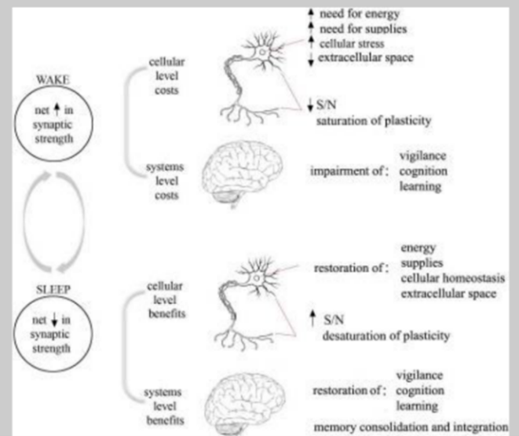

# Neuroplasticity of Sleep
*By Sam Grinshpun*

```{contents}
```

## Introduction
When we sleep, the body enters a stage of reversible rest. This is the time the body recharges itself to function properly the next day. We spend about one-third of our lives sleeping, but trouble sleeping is becoming an increasing issue. In America, reports show 35% of adults rate their sleep quality slow and have insomnia symptoms. 45% percent of adults have trouble falling asleep one night per week and 23% of adults have trouble 5 nights a week or more (Medic et al, 2017). Sleep loss is also becoming an increasing problem for students in high school and college. To mitigate sleep problems and promote rest, understanding how sleep works is an important first step, followed by the effects of sleep loss. However, sometimes sleep problems arise from a disorder, and the approach to mitigating these issues would differ from otherwise healthy people. The aim of this chapter is to dive into how sleep works, how sleep benefits the brain, and how sleep deprivation and disorders affect the person.

## Sleep Basics: Sleep Stages, Circadian Rhythm, and Neurotransmitters
### Sleep Stages
Human sleep can be split in two: rapid eye movement (REM) and non-rapid eye movement (NREM). NREM sleep consists of 4 distinct stages. A short initial stage (stage one) transitions the sleeper from wakefulness to sleep and constitutes under ten percent of total sleep. During the transition from wake to a “light sleep stage”, The heart rate and breathing slow down, muscle activity relaxes, and the EEG pattern of the brain shifts from alpha waves (brain waves associated with wakefulness) to waves that are characterized by low-voltage and mixed-frequency.  After stage 1, people descend into stage 2, a deeper sleep with the physiological changes continuing and the body temperature dropping. Stage 2 makes up the majority of the total sleep period (~50%) and increases in length with each NREM cycle, such that Stage 2 sleep occurs predominantly during the latter half of the night. Finally, K-complexes (large spikes in the EEG waveform) begin to appear in stage 2, punctuating the mixed frequency rhythms continued from stage 1 (Institute of Medicine, 2006). Stages 3 and 4 are often grouped together and define “slow wave sleep”, a period when the EEG waves transition to delta frequencies (high-voltage, slow waves). Together, these stages constitute ~20% of sleep time, are the deepest point of sleep, and predominantly occur in the first half of the night. The main differentiating factor is a slightly higher arousal threshold (harder to wake up) in stage 4. Once the NREM cycle is complete, the body transitions into REM sleep. During REM sleep, heart and respiratory rate increases, EEG activity transitions back to stage 1-like activity, and our eyes exhibit bursts of “rapid eye movements”. People also dream during REM sleep, which the body compensates for by paralyzing the muscles to prevent acting out dreams (Institute of Medicine, 2006). Once one cycle of NREM and REM ends, a new one begins until certain controls and environmental cues trigger the body to wake up. These controls are the body’s circadian rhythm, which will be covered in the next section.

### Circadian Rhythm
Circadian rhythm can be defined as the body’s internal biological clock comprised of regulatory mechanisms and physical changes that occur during a 24-hour period. There are also environmental cues and bodily changes that line up with circadian rhythm. For instance, light is one of the biggest environmental cues that affect a person’s wakefulness. Typically, people are awake during the day and asleep during the night. It is important to note that people can have different circadian rhythms depending on various circumstances or stressors in their lives. The body also changes with respect to temperature, hormone release, food consumption as well as heart rate in congruency with the biological clock (Institute of Medicine, 2006). One of the most important controls of the circadian rhythm happens in the superchiasmatic nucleus (SCN) of the hypothalamus. In transitioning from light to dark, the SCN receives inputs from the body and modulates neuronal pathways that transition the body to sleep. The SCN also regulates the amount of melatonin that is put into circulation by the pineal gland. The SCN can perform this change by altering how much signal it sends to GABA. The presence or lack of signal stops or starts pathways that regulate melatonin’s activity (Reddy et al, 2018). Disruptions in the circadian rhythm or the parts of the brain that control it can cause detrimental physical and mental repercussions along with disorders (Reddy et al, 2018). The body’s Circadian Rhythm is a natural and critical element in maintaining the body’s sleep-wake cycle and bodily homeostasis. Since we have hinted at the presence of neurotransmitters during sleep, will look at some common ones that are involved during arousal and sleep.

### Common Neurotransmitters in Wakefulness and Sleep
During sleep and wakefulness, neurotransmitters play a role in constituting a person’s desire to sleep or not. One neurotransmitter involved in wakefulness is histamine. Histamine cells are in the posterior hypothalamus, and when the hypothalamus receives signals from histamine, the cell depolarizes (positive charge inside cell). Depolarization of the cell helps encourage wakefulness (Mendelson, 2001). If histamine cells undergo a lesion or inhibited, studies have seen that it causes sleepiness. Inhibition of histamine can explain why certain medications like antihistamines can cause drowsiness (Siegel, 2004). Other neurotransmitters involved in wakefulness include serotonin and norepinephrine, and they work in a similar way to histamine to promote wakefulness. Noradrenergic and serotonergic cells are largely localized in the brain stem but have activity in different areas of the brain (Mendelson, 2001).  The activity of these neurotransmitters is the greatest during the day. However, they all decline during NREM sleep and are virtually idle during REM sleep. They are all inhibited by GABA, which is a primary neurotransmitter involved during all sleep stages.  GABAergic cells are centered in the basal forebrain and the anterior hypothalamus, and their activity is most apparent during the night unlike wakefulness neurotransmitters (Siegel, 2004). Another important neurotransmitter in consideration of sleep is Melatonin. Melatonin is also controlled by GABA but is most active during the night. When melatonin activity is high, the person feels sleepier. Melatonin’s activity also changes due to light and darkness cues melatonin production with SCN activation (Zisapel, 2018). The activity of all neurotransmitters discussed dictates when the body sleeps or not. As we have seen the way sleep progresses and what is involved to medicate sleep, we will consider how sleep may promote plasticity in the synapse and in memory.

## Sleep-Dependent Plasticity in Synaptic Strength and Memory Consolidation
### Synaptic Homeostasis Hypothesis 
The synaptic homeostasis hypothesis states that synaptic strength is the greatest during the day and lowest in the night. The decrease in synaptic strength at night is compensation for its increase during the day, and this tradeoff is important for synaptic function. It seemingly decreases the most during Slow Wave Activity of NREM sleep and wake time also can affect activity (Wang et al, 2011). Figure 1 below displays some of the motivations and justifications that lead to formulating this hypothesis. During wakefulness, the neurons require more energy and supplies to function properly, as well as the potential to undergo cellular stress. This is due to cognition and learning during the waking state which require high levels of synaptic strength and activity. The ability then to increase plasticity becomes harder with the work that the neurons do to support the brain. Once the body transitions to sleep, then synaptic strength starts to decrease as less energy and resources are being used for daily function. With the body in the resting state, this allows for resources to be restored to benefit the brain and increase synaptic strength. It allows for plastic changes to happen when the system is not focused on other priorities. This hypothesis is also tied to memory consolidation as sleep would help with this as well (Tonini et al, 2014). It becomes rather clear that the basis of this hypothesis is compensation, where neuronal activity that decreases during the night serves to benefit the high activity during the day (Tonini et al, 2014).


**Figure 1. The Synaptic Homeostasis Hypothesis**


Neurologically, certain mechanisms dictate whether synaptic strength goes up or down. When wakefulness neurotransmitters decrease, this would then lead to a change from Long Term Potentiation (LTP) to Long Term Depression (LDP). In changing from LTP to LDP, expression of AMPA receptors decrease in the neuron, which then would decrease synaptic strength. The opposite would happen in wakefulness.  In mice models studies, GluA1-containing AMPARs have expressions around 40% during wakefulness compared to sleep (Tonini et al, 2014). Also, the number of dendritic spines decrease during sleep and increase in wakefulness, which can also underlie synaptic strength changes (Tonini et al, 2014).

## Memory Consolidation
Sleep can also help with memory consolidation. Commonly, memories are classified in declarative and non-decorative categories. Declarative memories are defined as memories that are consciously accessible. Examples of this can include fact-based information or remembering events in one’s life. Non-declarative memories are often regarded as nonconscious. These are memories that are used without much conscious attention to them. Examples of this include riding a bike or tying shoes (Walker et al, 2004) (Stickgold, 2005). Many studies have examined benefits for memory in behavioral changes. For declarative memories, research has found that intensive language training correlates with an increase in REM sleep, which can indicate that REM sleep is important in relation to memory and retaining information (Walker et al, 2004). However, some studies have found contradicting results where memory formation is not sleep-dependent in relation to verbal memory.  Selective members of researchers that found this contradiction also found that abundant Slow Wave Sleep (SWS) can help with word pair association tasks (Stickgold, 2005). Some of these findings start to shine light that REM sleep and SWS in NREM are important in relation to maintaining declarative memories. More research is still required to have more definitive conclusions.

For non-declarative memories, there is more agreement in terms of results. The strongest evidence is localized in procedural memories. Studies that looked at motor tasks have found that sufficient night sleep can improve sequential motor tasks compared to just being awake. They further demonstrate that a loss of sleep-in fact may make performance worse for certain tasks. Many of the studies have focused on the role of NREM sleep (some REM as well) in these tasks, especially during stage 2. Other studies have also been done on visual perceptual and auditory learning which also see improvement from different points of sleep (Walker et al, 2005). For both these memory types, more research would benefit in solidifying these results, but the roles of REM and NREM sleep are gaining prominence. 

Further research has been able to find evidence of a neural link to memory consolidation. One studied mechanism is hippocampal neural replay. Neural replay refers to patterns of neuronal activity seen during a task to be reactivated during sleep. Neural replay helps strengthen memory of the task in question. This has been observed in PET scans of people who did a reaction time motor skill task. When the subjects were in REM sleep, neurons patterns seen during the motor task reappeared. People’s performance of the same task increased the next day, indicating that neural replay can play a role in strengthening memories. Hippocampal neural replay has been mostly studied in declarative memories although it has been looked at in procedural memories as well. The role of neural replay in non-declarative memories, however, is more unclear and would need further research (Walker et al, 2004).

## Sleep Loss and Sleep Disorders: Sleep Deprivation, Insomnia and Sleep Apnea
### Sleep Deprivation
It becomes rather clear that sleep is important to maintain the function of the brain and the body as a whole. Consequently, losing sleep causes these functions to impair as the body is not able to get proper rest to restore itself. Sleep deprivation can consist of total lack of sleep or getting less sleep than needed in a certain time frame. In otherwise healthy adults, sleep deprivation could happen because of jetlag after changing time zones, work-related or personal stressors, environmental factors, as well as various lifestyle factors. Common symptoms that arise as a results of sleep loss include longer reaction time, being distracted more easily, memorizing information, tiredness, and stress (Orzel-Gryglewska, 2010). Sleep loss also affects several cognitive processes in the brain including learning, working memory, and attention. Working memory is one of the most studied effects of sleep deprivation. Research regarding working memory has found consistently that working memory task performance decreases because of sleep deprivation of various lengths. The tasks can include doing word recall, digit span, as well as accuracy and speed components of memory which link closely to attention (Frenda et al, 2016). Studies have also investigated brain activity changes because of sleep deprivation. Notably, they have found reductions in activity in the frontal and parietal lobes of the brain in relation to memory. Studies found larger activity drops in the posterior parietal lobes as they are important for the maintenance of information. The frontal lobes results have been more mixed as some studies found no changes at all. This discrepancy could be explained by compensatory mechanisms the brain may have in response to sleep deprivation. This may happen for instance if the task becomes more difficult, compensatory mechanisms may activate. Caffeine or other stimulants may also contribute to this activation as well (Frenda et al, 2016). 

Sleep deprivation can also inhibit LTP in the hippocampus, which is an important mechanism for maintaining connections between neurons (Alkadhi et al, 2013). Neurotransmitters such as norepinephrine and serotonin that are normally low in activity during sleep increase in levels because of sleep deprivation. Melatonin production also decreases because of sleep deprivation. (Medic et al, 2017). Sleep deprivation has various effects on a person from the brain to the neuron, but these effects don’t just occur in healthy people. Sleep disorders can lead people to experience symptoms of sleep deprivation along with disorder related ones. The next section will investigate sleep disorders, how they affect people, and the common treatment methods against them.

```{note}
**First Sleep Deprivation Experiments in Animals**
We have seen that human sleep-deprivation can lead to worse functioning overall. Yet, there are still people who take sleep deprivation to its upper limits.  Randy Gardner currently holds the former world record for staying awake for 11 days in 1964. In his ordeal, he experienced hallucinations, paranoia, and motor control loss. Although he recovered, he reportedly developed Insomnia later in his life (Keating, 2022). Although sleep deprivation has been examined in human cases, the first experiments were performed on animals. It is important to note that the experiments mentioned would not be allowed with today’s ethical standards. 

The first major experiment was conducted in 1894 by Russian scientist Marie De Manaceline. In her procedure, she kept 10 puppies awake and active until they passed away. The puppies only lasted a few days under these conditions. Manaceline also noted that before death the body temperatures decreased substantially and that the older puppies were able to last just a little longer than the younger ones. In the initial drops in body temperature, (below 1 degree Celsius), motor activity became weaker and red blood cell count decreased. She also saw a lot of degeneration on the cortical tissue of the brain, compared to puppies she only starved (Bentivoglio et al, 1997). The stark changes Manaceline indicated that the puppies’ bodies start to shut down due to complete sleep deprivation. Given the changes and the short time it took, Manaceline’s work started to capitalize the importance of adequate sleep and the extreme consequences of sleep deprivation.

Four years later, Italian Scientists Lamberto Daddi and Giulio Tarozzi expanded on Manaceline’s work with adult dogs. 2 dogs were deprived of sleep but otherwise fed and maintained. A third dog was deprived of both sleep and food. By comparing the degeneration of Purkinje cells in the cerebellum and pyramidal neurons in the anterior lobe, Daddi and Tarozzi determined that while sleep initiates neural degradation, a healthy diet slows the degradation process. A subsequent experiment done by Daddi proved starvation alone did not have as severe effects as lack of sleep, like Manaceline (Bentivoglio et al, 1997).

Following this, Cesare Agostini (1864-1942) thought that the fatigue felt by prior dogs could have not been total sleep loss. He tried to control this by making sure the dogs were always awake by watching them and implementing loud noises in their cages. His dogs survived for two weeks like this. He also observed one of the first human cases of long-term sleep deprivation and reported their symptoms (Bentivoglio et al, 1997).

In essence, these experiments were some of the first to study the effects of sleep loss in animals. These experiments, although extreme, gave strong initial insights as to what happens when the body does not get enough sleep. More importantly, this initial research provided further emphasis on the vitality of sleep-in order for the whole body to function properly.

```

### Insomnia
Insomnia is a common sleep disorder characterized by difficulty falling asleep or maintaining sleep from waking up during the night. Some symptoms of this disorder can be found in its definition, but additionally can include anxiety, sleepiness, and depression. In fact, evidence suggests insomnia could be linked with psychiatric disorders that include anxiety and depression. An 8000-population study suggested 40% of insomniacs had various psychiatric disorders (Walia et al, 2016). Insomnia symptoms are reportedly present in about 30% of the population at least occasionally. However, diagnosis of Insomnia would require symptoms to occur three times a week for 3 months or more (Someren, 2021). Factors such as stress, genetics, and major life events can increase vulnerability for Insomnia. Insomniacs are also seen to have reductions in gray matter in the frontal and temporal lobes, much like sleep deprivation (Wu et al, 2020). Insomniacs have reduced time in sleep stages like stage 3 and especially REM sleep. EEG patterns often resemble instability, and combined with the reduction in sleep time is sometimes called “restless sleep” (Someren 2021).

Insomnia can be treated with Benzodiazepines or Selective Serotonin Reuptake Inhibitors to alleviate symptoms and promote sleep (Krystal et al, 2019). However, medications are not always the first-line treatment. Another very common treatment involves different behavioral therapies. This can include sleep hygiene, cognitive therapy, and relaxation techniques. Benefits of using this approach is the mitigation of side effects that medications can cause (Krystal et al, 2019). Although these treatments may not benefit everyone, they are common ones that can help relieve the symptoms of insomnia.

### Obstructive Sleep Apnea
Obstructive Sleep Apnea (OSA) is defined as an airway collapse because of decreased airflow during sleep. People with OSA experience many similar symptoms to Insomnia but differ as some of the symptoms (especially ones at night) are attributed to the obstruction of the airway. Arousal often is what may restore muscle tone which may explain why arousal happens frequently during the night (Macey et al, 2002). OSA is normally diagnosed by a Polysomnography or with a home testing kit. Age and body mass factors are contributors to the risk of developing OSA (Walia et al, 2019). Patients with OSA have cognitive deficits to attention, working memory, and learning. Some aspects of learning and memory impairments made be sometimes mild in adults, but still shown to be lower. OSA Patients also have reduction in gray matter volumes in the frontal, parietal, temporal, and hippocampal regions of the brain which can underlie cognitive deficits (Krysta et al 2019).

The most standard treatment for OSA is Positive Airway Pressure Therapy (PAP). PAP is when a patient gets pressurized air through a breathing tube which aims to help increase air flow. Other treatments methods can involve surgical interventions in more severe cases. More research and treatment methods are being welcomed as sometimes PAP can cause some discomfort to patients, which can affect compliance (Krystal et al, 2019).

## Conclusion
In concluding remarks, we have covered sleep from its basics, sleep’s role in plasticity, and the effects of sleep deprivation and disorders on the whole body. In healthy individuals, the basics of sleep work together with the neuroplastic elements to achieve a working neurological system through rest and restoration. When someone is sleep deprived, they can experience negative changes from the basic elements of sleep to plasticity, which implies a connection between all aspects of sleep. With this respect, Sleep is clearly a crucial element for functioning, and it is paramount for people to optimize sleep. By understanding the foundations of sleep and what it means to lose sleep, hopefully sleep becomes prioritized and advocated for. However, sometimes sleep deprivation arises from disorders where the person cannot exactly help losing sleep. The approach then must be modified to mitigate sleep loss with medication or more invasive approaches in some cases. With more sleep research to come, hopefully some uncertainties we have brought can be clarified as well. In the wise words of sleep researcher Allen Rechtschaffen, “If sleep does not serve an absolutely vital function, then it is the biggest mistake the evolutionary process has ever made”.

## Chapter Quiz
1.	During the REM stage of sleep
    * **A.** Breathing and heart rate slow down.
    * **B.** Brain wave patterns become a mixture of low voltage and mixed speed of waves.
    * **C.** Brain wave patterns become a mixture of high voltage and slow waves.
    * **D.** The brain waves are different from a wakeful state.
2.	A person spends most of their total sleep-in stage.
    * **A.** 1
    * **B.** 2
    * **C.** 3/4
    * **D.** REM
3.	The Deepest sleep occurs in stage.
    * **A.** 1
    * **B.** 2
    * **C.** 3/4
    * **D.** REM
4.	Which of the following about the Circadian Rhythms is not true in terms of function?
    * **A.** They control the sleep-wake cycle.
    * **B.** They control muscle contractions.
    * **C.** They regulate body temperature.
    * **D.** The regulations closely resemble a 12- hour clock.
5.	SHORT ANSWER: What are some common symptoms of sleep deprivation? What happens to brain volumes in sleep deprived patients in respect to working memory?

6.	TRUE OR FALSE: Sleep Deprivation only happens in healthy people.

    * **A.** True
    * **B.** False

7.	TRUE OR FALSE: It is possible to function at full capacity without any physical/psychological defects when sleep deprived.
    * **A.** True
    * **B.** False

8.	SHORT ANSWER: What are the justifications for the Synaptic Homeostasis Hypothesis?

9.	Short Answer: What are some findings regarding sleep dependent memory consolidation? Do they all agree with each other? Is the role of REM sleep and SWS important to these findings?

10.	Obstructive Sleep Apnea differs from Insomnia in that.
    * **A.** Sleep Apnea causes breathing disruptions during sleep.
    * **B.** Sleep Apnea refers to difficulty in falling asleep.
    * **C.** Sleep Apnea affects the circadian rhythms.
    * **D.** Sleep Apnea leads to an urge to move the legs due to an unpleasant sensation.

11.	Which is the following is a treatment method that would not apply to Insomnia
    * **A.** Sleep Hygiene Education
    * **B.** Stress management
    * **C.** Positive Airway Pressure Therapy
    * **D.** Behavioral Therapy

12.	TRUE OR FALSE: Patients who have Obstructive Sleep Apnea can develop similar Insomnia Symptoms
    * **A.** True
    * **B.** False

13.	SHORT ANSWER: What are some cognitive defects in Insomnia and Sleep Apnea Patients? Are they mostly similar? Different? What about gray matter volumes in the brain?

### Answers

```{toggle}
1.	B
2.	B
3.	C
4.	D
5.	Common symptoms that arise as a results of sleep loss include longer reaction time, being distracted more easily, memorizing information, tiredness, and stress. Notably, they have found reductions in activity in the frontal and parietal lobes of the brain in relation to memory. They found larger activity drops in the posterior parietal lobes as they are important for the maintenance of information.
6.	B
7.	A
8.	The justification of this is that the synaptic strength that decreases at night is to restore resources for when it increases during the day. So this acts as a compensatory mechanism.
9.	Some findings include that language training correlates with more REM sleep, sequential motor task improvement, remembering word pair associations. There are some inconsistencies for declarative memories, but more certainly in non-declarative memories. Both REM sleep and SWS play a large role in these findings.
10.	C
11.	A
12.	B
13.	Common cognitive deficits include learning, attention, and memory. Brain scans typically show reduced gray matter volumes in both Insomnia Patients and Sleep Apnea Patients. 

``` 

## References
```{toggle}
Alkadhi, K., Zagaar, M., Alhaider, I., Salim, S., & Aleisa, A. (2013). Neurobiological consequences of sleep deprivation. Current neuropharmacology, 11(3), 231–249. https://doi.org/10.2174/1570159X11311030001

Bentivoglio, M., & Grassi-Zucconi, G. (1997). The pioneering experimental studies on sleep deprivation. Sleep, 20(7), 570–576. https://doi.org/10.1093/sleep/20.7.570 

Frenda, S. J., & Fenn, K. M. (2016). Sleep less, think worse: The effect of sleep deprivation on working memory. Journal of Applied Research in Memory and Cognition, 5(4), 463–469. https://doi.org/10.1016/j.jarmac.2016.10.001 

Institute of Medicine. 2006. Sleep Disorders and Sleep Deprivation: An Unmet Public Health Problem. Washington, DC: The National Academies Press. https://doi.org/10.17226/11617.

Keating, S. (2022, February 24). The boy who stayed awake for 11 days. BBC News. https://www.bbc.com/future/article/20180118-the-boy-who-stayed-awake-for-11-days 

Krystal, A. D., Prather, A. A., & Ashbrook, L. H. (2019). The assessment and management of insomnia: an update. World psychiatry : official journal of the World Psychiatric Association (WPA), 18(3), 337–352. https://doi.org/10.1002/wps.20674

Krysta, K., Bratek, A., Zawada, K., & Stepańczak, R. (2017). Cognitive deficits in adults with obstructive sleep apnea compared to children and adolescents. Journal of neural transmission (Vienna, Austria : 1996), 124(Suppl 1), 187–201. https://doi.org/10.1007/s00702-015-1501-6

Macey, P. M., Henderson, L. A., Macey, K. E., Alger, J. R., Frysinger, R. C., Woo, M. A., Harper, R. K., Yan-Go, F. L., & Harper, R. M. (2002). Brain morphology associated with obstructive sleep apnea. American Journal of Respiratory and Critical Care Medicine, 166(10), 1382–1387. https://doi.org/10.1164/rccm.200201-050oc 

Medic, G., Wille, M., & Hemels, M. E. (2017). Short- and long-term health consequences of sleep disruption. Nature and science of sleep, 9, 151–161. https://doi.org/10.2147/NSS.S134864

Mendelson, W. B. (2001). Neurotransmitters and sleep. Journal of Clinical Psychiatry, 62, 5-8.

Orzeł-Gryglewska, J. (2010). Consequences of sleep deprivation. International Journal of Occupational Medicine and Environmental Health, 23(1). https://doi.org/10.2478/v10001-010-0004-9 

Reddy, S.N., Reddy, V., & Sharma, S. (2018). Physiology, Circadian Rhythm.

Siegel J. M. (2004). The neurotransmitters of sleep. The Journal of clinical psychiatry, 65 Suppl 16(Suppl 16), 4–7.

Stickgold, R. (2005). Sleep-dependent memory consolidation. Nature, 437(7063), 1272–1278. https://doi.org/10.1038/nature04286 

Tononi, G., & Cirelli, C. (2014). Sleep and the price of plasticity: from synaptic and cellular homeostasis to memory consolidation and integration. Neuron, 81(1), 12–34. https://doi.org/10.1016/j.neuron.2013.12.025

Walia, H. K., & Mehra, R. (2016). Overview of Common Sleep Disorders and Intersection with Dermatologic Conditions. International journal of molecular sciences, 17(5), 654. https://doi.org/10.3390/ijms17050654

Walker, M. P., & Stickgold, R. (2004). Sleep-dependent learning and memory consolidation. Neuron, 44(1), 121–133. https://doi.org/10.1016/j.neuron.2004.08.031 

Wang, G., Grone, B., Colas, D., Appelbaum, L., & Mourrain, P. (2011). Synaptic plasticity in sleep: learning, homeostasis and disease. Trends in neurosciences, 34(9), 452–463. https://doi.org/10.1016/j.tins.2011.07.005

Wu, Y., Zhuang, Y., & Qi, J. (2020). Explore structural and functional brain changes in insomnia disorder: A PRISMA-compliant whole brain ALE meta-analysis for multimodal MRI. Medicine, 99(14), e19151. https://doi.org/10.1097/MD.0000000000019151

Van Someren, E. J. (2021). Brain mechanisms of insomnia: New perspectives on causes and consequences. Physiological Reviews, 101(3), 995–1046. https://doi.org/10.1152/physrev.00046.2019 

Zisapel N. (2018). New perspectives on the role of melatonin in human sleep, circadian rhythms and their regulation. British journal of pharmacology, 175(16), 3190–3199. https://doi.org/10.1111/bph.14116


``` 
