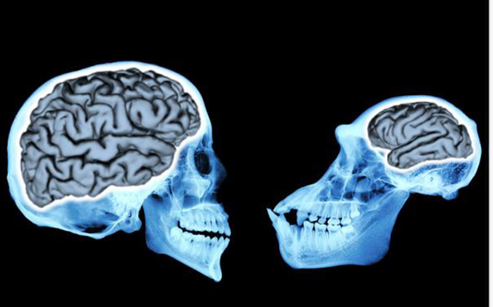
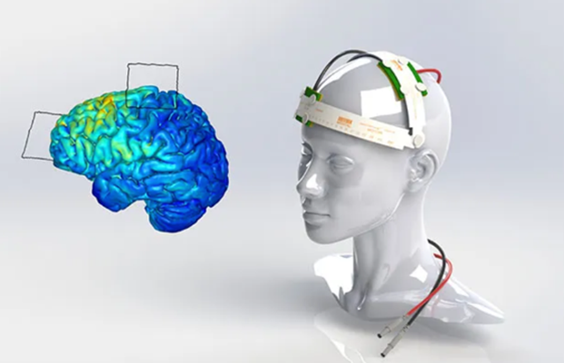

# Artificially Changing The Brain: The effect of technology on our neural plasticity
*By Candi Albarren*

```{contents}
```

## Introduction
In a world where many people face mental health issues, there's a promising solution called brain stimulation therapies. The story revolves around Megan, a woman who overcomes severe OCD and depression by getting an electrical device implanted in her brain. The device uses electrical impulses to help regulate her brain activity, leading to significant improvements in her daily life. However, as scientists explore how our minds work and the impact of technology, it raises interesting questions about the balance between progress and potential risks. From understanding how our brains adapt to new things, to looking at the effects of technology on teenagers. Megan’s story will take us through the complex world where our minds and advanced treatments meet. Megan story goes beyond individual experiences, showing a greater picture of our ongoing journey to better understand and improve our minds in a world shaped by technological advancements.

## The Impact of Technology on Cognitive Abilities
In today's world, technology seamlessly integrates into our daily routines, revolutionizing the way we live, work, and even think. This chapter explores the significant impact that technology has on cognitive abilities. Taking into account both the historical background of human cognition and the current effects-both negative and positive of technology on cognition. Before modern technology people relied on innate memory, critical thinking, and problem-solving to navigate the world. These days, technology affects every part of our lives, helping us with everything from complicated calculations, creative thinking to navigating streets. The chapter initially explores cognition evolutionarily before delving into the complex effects of technology on cognition, including both negative and positive aspects. 

Human cognitive abilities have undergone remarkable evolution throughout history (Muthukrishna, 2018). This section delves into the origins of human intelligence, emphasizing the role of social interactions and cognitive skills in adapting to environmental challenges. Our human brains are truly exceptional. When our ancestors faced natural obstacles, competition being one of them, the emergence of unique traits like advanced social behaviors and greater cognitive abilities was accelerated by a competitive environment. An alternative interpretation of human intelligence according to the "social tool," indicates that many of our mental adaptations evolved to help us navigate social relationships and promote group cooperation for tasks like hunting and foraging. (Flinn, 2005). Nonetheless, our cognitive capabilities extend to a broader range of functions such as understanding the physical and biological aspects of the world. Including navigation in the ability to make sense of the spatial aspect of the world . Over millions of years, hominin brains have expanded significantly, growing more than threefold in size, a trend observed in numerous species (Muthukrishna, 2018). Technology has become a regular part of our lives, starting from basic tools like sharp stones used as knives, then progressing to computers, CRISPR, and the latest addition, artificial intelligence (Gregersen).


Figure 1. An analysis of 94 hominin fossils found that the average brain size of human ancestors increased gradually and consistently over the past 3 million years.

Before delving further into this chapter, it's important to grasp a few key definitions. First, there's Neural Plasticity, which refers to the adaptability of the nervous system. Involving the ability to reshape, reconfigure, or establish new connections within the nervous system in response to internal or external stimuli. Adaptability hinges on neurons' capacity to strength efficiency of synaptic communication through a range of mechanisms collectively termed Synaptic Plasticity (Aparicio, 2019). Secondly, we have Cognition, processes that are responsible for acquiring, storing, manipulating, and retrieving information, playing a role in various aspects of our daily lives (Cambridge).  

## Early Age Technology Influence on Attention
Given that neural plasticity allows the nervous system to adapt to both internal and external stimuli, it’s crucial to understand how early exposure to technology can affect a child's cognitive development. Due to the early years of a child's life, from birth until around age five, the critical period is important. This study investigates the early exposure to technology and how it can have profound impacts on neurological function throughout development. Dr. Evelyn Law studies the impact of screen use among infants and children. In one study (Fliesler, 2023), weekly television time was monitored from infancy to 9 years of age and compared to cognitive assessments and neurological function. She found that for each additional hour of screen time, attention and executive function declined. Neurological testing supported the findings with theta wave activity increasing and beta wave activity decreasing as early as 12 months old and continuing through childhood.  Clearly, television exposure is altering neurological function, but how? 

## Technology's Impact on Emotional and Social Intelligence: Impairments in Cognition
The younger generation uses technology, teenagers use social media to follow and chat with others on Instagram or Tiktok. Following many famous celebrities. It’s important to examine how technology might impact the emotional and social intelligence of adolescents. The chapter examines the psychological and emotional effects of technology use on adolescents aged 14-18. Adolescence is a time of personality transitions that may be linked to lower levels of happiness and self-worth. Which are frequently accompanied by media consumption, including internet usage. Surprisingly, despite increased digital technology access, research suggests that the mental well-being of adolescents remains stable. However, the study found that excessive digital technology use, particularly by girls on social media, could have effects on teenagers' mental and emotional health. Mental health might be due to the possibility of cyberbullying on social media and the creation of false celebrity body image models. Demonstrating how teenage girls' emotional and mental health might decline due to excessive use of technology. Furthermore, work needs to be made to understand how technology influences the emotions and mental health of teenagers (Limone, 2022). 

## London Taxi Driver Training: How Learning the Streets Alters Brain Structure
In addition to how technology affects social and emotional intelligence, we also want to examine how technological advancements have taken over, making it unnecessary for people to remember directions or phone numbers. Proposing the question of what potential cognitive effects there might be from not having to memorize information. A study on memorization was done to see if London taxi drivers’ brains are different from non-taxi drivers. The researchers studied three groups: London taxi driver trainees, those who failed to become taxi drivers, and non-taxi drivers for comparison. The taxi driver trainees had to memorize a massive number of London streets, which was before GPS was commonly used. The scientists scanned the taxi drivers’ brains and discovered changes in the size (volume) of a brain region called the hippocampus. Specifically, those trainee taxi drivers who successfully qualified by learning "the Knowledge" (which is an extensive knowledge of London's streets and landmarks) had an increase in gray matter volume in the back part of their hippocampus. Suggesting that the hippocampus can become plastic and grow when people learn complex spatial information like navigating the streets of London during their training (Woollett, 2011). It’s acknowledged that the enlarged hippocampus region plays a significant role in shaping both spatial memory and memory retention, two abilities that are essential for critical thinking and problem-solving. Suggesting that an over-reliance on GPS may have deleterious effects on the brain's ability to retain spatial information. Raising questions about what will happen to the hippocampal region of the brain if technology is heavily relied on. Will it shrink over time, or will it remain the same? (Woollett, 2011).
 

Figure 2. The map above shows the streets of Central London.

## Enhancing Cognitive Functions with Brain-Training Games and Apps
In comparison with the negative impact of technology use on cognition. Some studies have shed light on the positive aspects of technology use in enhancing cognition in relation to brain training games and apps. Technology is being used to manage age-related cognitive decline. Cognitive Mobile Games (CMG) have emerged as a potential solution, especially for older adults, including those at more advanced ages. To address the limited evidence regarding their effectiveness, a study analyzed data from 12,000 participants aged 60 to over 80 years who engaged in 100 gaming sessions. The results revealed that individuals across various age groups experienced enhancements in their game scores and processing speed as they used CMG. These findings suggest that older adults can improve their cognitive performance through the use of games like CMG (Bonnechère, 2021). Technology improves speed, selective attention, short-term memory loss, and brain stimulation, all of which have an impact on older adults' cognitive abilities.

```{note}
**Unlocking the Power of Brain Stimulation Therapies: A Deeper Dive into Mental Health Solutions**
More than one in five adults in United States suffer from mental illness. Mental illness affects a person's thoughts, feelings, or behavior, leading to distress and difficulties in functioning. Various mental illnesses, such as depression, schizophrenia, and ADHD, can manifest in distinct ways, altering a person's mental state. For example, depression can cause feelings of sadness, emptiness, tearfulness, and hopelessness. Causing loss of interest in most or all normal activities such as hobbies or sports.  Mental illnesses are in response to neural dysfunction, necessitating treatments to intervene with, and restore normal neural communication. One such category of technologies gaining appeal is brain stimulation therapies which help with regulating brain activity. These therapies work by stimulating or suppressing neural activity using electrical impulses applied to the scalp (transcranially) or directly to the brain through implanted electrodes (intracranially). Another method involves generating electrical currents by applying magnetic fields to the head (National Institute of Mental Health). An example would be the image below, which illustrates an electric headset aimed to stimulate the brain. Where a transcranial direct current stimulator (tDCS), which applies an electrical current to a particular region of the brain, is set up with a common anode and cathode. The anode is the positive electrode, placed over the area of the brain you want to stimulate, and the cathode is the negative electrode, usually placed on the area acting as a reference point. The warm colors indicate the current spread through the brain predicted by a computer model.
 
A great case study that illustrates the positive impact of brain stimulation therapies is the case of Megan, a woman who battled severe OCD and depression. Megan underwent a surgical procedure to have an electrical device implanted in her brain in the left prefrontal cortex and either the dorsomedial prefrontal cortex or anterior cingulate cortex for her OCD and depression. Having an electrical device implanted in her brain allows Megan to adjust the voltage using a remote control. Significantly improving her daily life; she became punctual, regained her ability to read and write effectively, secured employment, and now enjoys a fulfilling life. However, the less good news is that Megan’s happiness might not last. Every 6 months she acclimates to a new setting because the benefits of living a normal life, free from OCD and depression begin to wear off. The maximum voltage the brain can take before its beings to damage brain tissue is 10.5 volts. The doctor had left her at 3 volts and now, being only in her 30s she’s at 6 volts. Given that the maximum acceptable voltage is 10.5 volts, Megan's age of 30 and her voltage of 6 volts raises concerns because doctors are unsure of the potential effects of what could happen to Megan’s mood when reaching the maximum safe voltage. (Chung, 2019).

Ongoing research is aimed at assessing the optimal applications and the overall effectiveness of these therapies across various mental illnesses. The U.S. Food and Drug Administration has granted authorization for these therapies to treat specific mental disorders, such as depression, bipolar disorder, and obsessive-compulsive disorder (OCD). Researchers both at the National Institute of Mental Health (NIMH) and across the nation are actively conducting numerous studies involving individuals with mental disorders and healthy volunteers. Clinical trials have played a role in expanding treatments for mental health issues.



```

## Unlocking the Potential of AI in Mental Healthcare: Impact on Mental Health Diagnosis and Treatment
Not only have brain training games improved cognitive function, but artificial intelligence (AI) simulators for computers have also been developed as a result of technological advancements. AI has applications in healthcare, education, and error reduction. One of the most common medical conditions in the US is mental illness. Therefore, examining whether advanced technology can improve cognitive function within the healthcare system is important. Research indicates that artificial intelligence (AI) holds potential to transform the field of mental healthcare. The article delves into AI's role in healthcare, with a focus on its applications in mental health. The study evaluates 28 studies that used a variety of data sources, including social media, brain scans, health records, and mood ratings, to predict and categorize mental health conditions like suicidal thoughts, depression, and schizophrenia. AI's accuracy in mental health is early research showing that machine learning can help comprehend and classify mental health issues, assisting in the identification of the most effective treatments.  As AI techniques advance, they offer the potential to redefine mental illnesses more objectively, detect them at earlier stages, and personalize treatments based on individual characteristics. However, it's important to note that AI doesn't replace human mental health practitioners; instead, serves as a valuable tool to support the diagnosis and treatment of mental health issues (Graham, 2019). Aiding in cognitive enhancement by using technology to assist healthcare practitioners in gaining a deeper understanding of mental states. Leading professionals to make better decisions and facilitating the creation of patient specific treatments, and the creation of new treatments. 

## Regular Internet Use in Older Adults Reduces Dementia Risk
Being aware of the advancements in technology, including the use of artificial intelligence and the ability to deliver education and health care. What impact does technology have on dementia patients? It's great to know that regular internet use can dramatically lower the risk of dementia in older adults, especially in this day and age when the internet is used by many. The internet acts as a gateway to a wealth of information, allowing individuals to stay engaged, connect with others through social platforms, and continuously learn. These activities stimulate the brain and contribute to building cognitive resilience, potentially slowing down age-related cognitive decline. However, as with any tool, there's a need for moderation. The study suggests that striking a balance is crucial. While a moderate amount of daily internet use is (0.1–2.0 hours) to maintain a healthy brain, excessive use might have negative effects. Excessive screen time can often lead to a lack of movement, which damages the physical body and in-person social interactions, both of which are essential for one's overall well-being. Which serves as a reminder that, in a time when technology has become integrated in our daily lives, when used mindfully, it can be a powerful tool in promoting cognition. Technology gives us the means to stay informed, engaged, and connected. Keeping the brain of people who are older challenged and their cognitive processes sharp are vital steps on the path to a healthier aging process (Hara, 2023).

With technology's constant stream of quick notifications and information, people may develop a habit of thinking quickly and superficially. Which can be a possible reason for why technology is having negative effects on cognition. Similar to a muscle, the brain gains strength with regular use. According to the "use it or lose it" theory, certain brain regions that enhance cognition may weaken if they aren't exercised. The fast tempo of communication through technology may be a factor in the decline of sustained attention and critical thinking. The use of digital resources for obtaining information may also have an effect on memory, making the brain more efficient at finding information but less effective at incorporating and retaining information in the long run. 

Wrapping up the exploration of mental health solutions and the changing influence of technology on cognitive capacities, a number of significant discoveries have been made. In spite of worries about the possible negative impacts of technology, an alternative story emerged that emphasized the advantages of using cognitive mobile games to manage age-related cognitive decline. Artificial intelligence has the potential to significantly transform mental healthcare, and frequent internet use among older adults, showing a surprising alignment in lowering the risk of dementia. In summary, as we learn to use new technologies, establishing a balance is essential. Technology should be used thoughtfully, serving as a reminder that technology can be an effective tool in our collective desire for a better understanding of the functions of the human mind and for healthier aging when used with consideration. 

## Chapter Quiz
1. What is the primary focus of brain stimulation therapies as discussed in the essay?
    * **A.** Enhancing memory
    * **B.** Regulating brain activity
    * **C.** Treating physical ailments
    * **D.** Inducing sleep
 
2. Which government agency has granted authorization for brain stimulation therapies to treat specific mental disorders?
    * **A.** National Institute of Mental Health (NIMH)
    * **B.** National Library of Medicine
    * **C.** U.S. Food and Drug Administration (FDA)
    * **D.** National Institutes of Health (NIH)
 
3. What is Neural Plasticity, as defined in the essay?
    * **A.** The ability to adapt the nervous system
    * **B.** A type of brain surgery
    * **C.** A cognitive mobile game
    * **D.** A brain disorder
 
4. Define "cognition" in your own words and provide an example of a cognitive process.
 
5. How do London's taxi drivers navigate the city's complex streets, according to the text? What is the primary focus of the study discussed in the text?
 
 ### Answers

```{toggle}
1. Answer: b. Regulating brain activity
2. Answer: c. U.S. Food and Drug Administration (FDA)
3. Answer: a. The ability to adapt the nervous system
4. Answer: Cognition refers to mental processes involved in acquiring, storing, manipulating, and retrieving information. It includes activities such as perception, memory, problem-solving, and decision-making. An example of a cognitive process is memory, where the brain stores and recalls information.
5. Answer: According to the text, London's taxi drivers navigate the city's complex streets by memorizing a vast amount of information about the streets and landmarks, a process known as "the Knowledge." The primary focus of the study discussed in the text is to investigate how learning the intricate details of London's streets, especially before the widespread use of GPS, impacts the brain structure, specifically the size (volume) of the hippocampus.

``` 

## References
```{toggle}
Aparicio et al. (2019). “The impact of studying brain plasticity.” National Library of Medicine.
 
Bonnechère. (2021). “Brain training using cognitive apps can improve cognitive performance and processing speed in older adults.” National Library of Medicine.
 
“Brain Stimulation Therapies.” National Institute of Mental Health.
 
Chung, C. (2019). “The Remote Control Brain.” Invisibilia. 
 
Fliesler et al. (2023). “Babies and screen time: new research calls for caution.” Boston Children’s Hospital.
 
Flinn. (2005). “Ecological dominance, social competition, and coalitionary arms races: Why humans evolved extraordinary intelligence.” ScienceDirect. Vol. 26. Issue 1.
 
Graham et al. (2019). “Artificial intelligence for mental health and mental illnesses: an overview.” National Library of Medicine.
 
Hara. (2023). “Can using the internet protect from dementia?” Cognitive Vitality.
 
“Information about Mental health and the Brain.” National Library of Medicine.
 
Limone et al. (2022). “Psychological and emotional effects of digital technology on digitods (14-18 years): a systematic review.” Frontiers. Vol. 13.
 
Muthukrishna, Michael, et al. (2018). “The Cultural Brain Hypothesis: How Culture Drives Brain Expansion, Sociality, and Life History.” PLoS Computational Biology, vol. 14, no. 11.
Gregersen. “History of technology timeline.” Britannica. 
 
Woollett et al. (2011). “Acquiring the knowledge of London’s layout drivers structural brain changes.” National Library of Medicine.
(2015). “What is cognition?” Cambridge cognition.


``` 